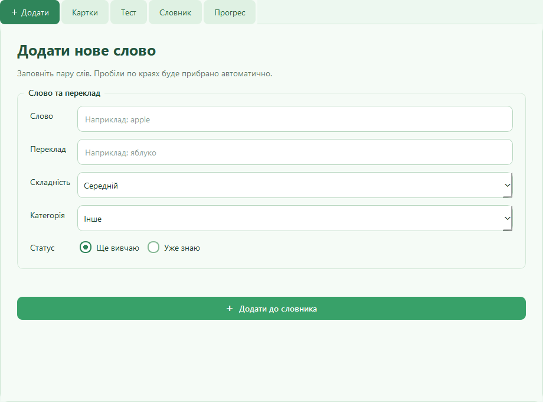
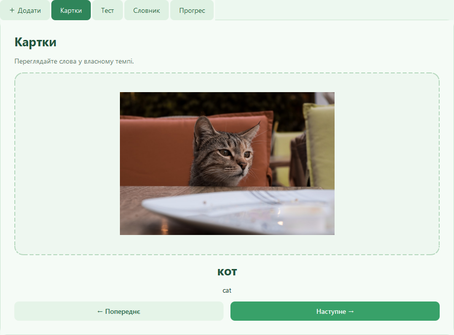
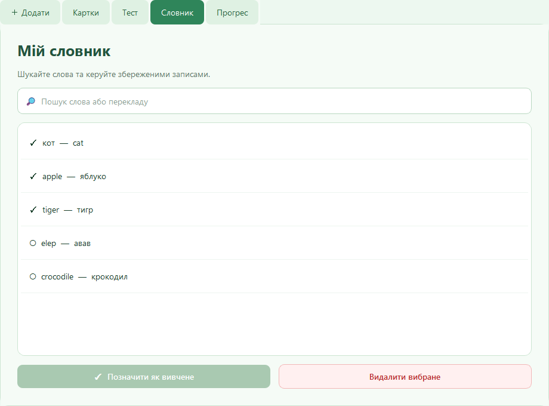
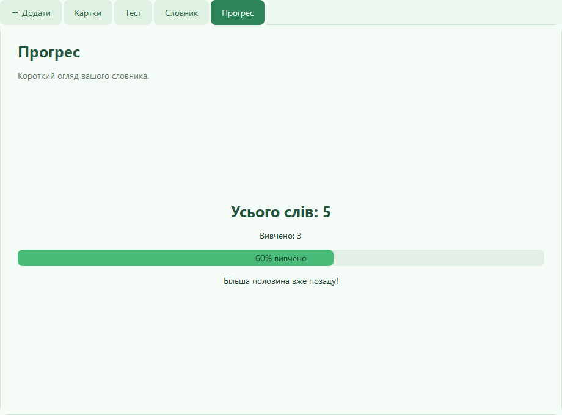

# Learn Words

<p align="center">
  A green-and-white PyQt6 desktop application for building a personal
  English–Ukrainian vocabulary, practising translations, and tracking progress.
</p>

## About the project

Learn Words is an educational desktop application designed for regular
vocabulary practice. Words are stored locally in SQLite, so the dictionary is
available after restarting the application and does not require an account.

The project started as a single-file PyQt5 application backed by JSON. It has
since been restructured into separate UI, persistence, validation, and network
modules, migrated to PyQt6, and given safer error handling.

## Features

- Add English words with Ukrainian translations.
- Assign a difficulty level and category.
- Mark a word as learned during creation or later from the dictionary.
- Browse vocabulary as visual cards.
- Automatically find card images through Wikimedia Commons.
- Practise with a multiple-choice translation quiz.
- Automatically mark correctly answered words as learned.
- Search by word or translation.
- View learned-word statistics and overall progress.
- Detect duplicates without regard to letter case.
- Validate alphabets, suspicious sequences, and empty input.
- Check entries through Wiktionary without freezing the UI.
- Continue working when an online service is temporarily unavailable.

## Screenshots

### Add a word



### Word cards



### Dictionary



### Learning progress



## Requirements

- Python 3.10 or newer
- PyQt6 6.6 or newer
- Internet connection for image search and online word validation

SQLite, `urllib`, `dataclasses`, and the remaining runtime modules are included
in Python's standard library. No separate database server or API key is needed.

## Installation

### Windows PowerShell

```powershell
git clone https://github.com/whistyx1/Dictionary.git
cd Dictionary

py -m venv .venv
.\.venv\Scripts\Activate.ps1
py -m pip install --upgrade pip
py -m pip install -r requirements.txt
```

If PowerShell prevents virtual-environment activation, run its Python directly:

```powershell
.\.venv\Scripts\python.exe -m pip install -r requirements.txt
.\.venv\Scripts\python.exe Learn_words_program.py
```

### Linux or macOS

```bash
git clone https://github.com/whistyx1/Dictionary.git
cd Dictionary

python3 -m venv .venv
source .venv/bin/activate
python -m pip install --upgrade pip
python -m pip install -r requirements.txt
```

## Running the application

From the project directory, run:

```powershell
py Learn_words_program.py
```

On systems where the Python launcher is unavailable:

```bash
python3 Learn_words_program.py
```

## How to use

1. Open the **Add** tab.
2. Enter an English word and its Ukrainian translation.
3. Select the difficulty, category, and initial learning status.
4. Press **Add to dictionary** or press Enter from the translation field.
5. Review saved entries on the **Cards** tab.
6. Use **Test** to practise translations.
7. Open **Dictionary** to search, delete, or manually mark a word as learned.
8. Check **Progress** to see the learned percentage.

The English field accepts Latin letters, spaces, apostrophes, and hyphens. The
translation field accepts Ukrainian letters and the same separators. If
Wiktionary does not recognise a rare name or specialist term, the application
shows a warning and allows the user to save it manually.

## Data storage

All vocabulary is stored locally in:

```text
data/words.db
```

The application creates the SQLite database and schema automatically. The
database is ignored by Git because it contains personal user data. To make a
backup, close the application and copy `words.db` to a safe location. Restore it
by placing the file back into `data/`.

## Online services and privacy

- **Wikimedia Commons** is used to search for word-card images.
- **Wiktionary** is used to check whether entered words exist.
- Requests run in Qt's background thread pool, keeping the UI responsive.
- No API key, user account, analytics service, or cloud database is used.

Search terms are sent to these public services only when image or word
validation is required. Progress and dictionary records remain in local SQLite.

## Project structure

```text
Dictionary/
├── Learn_words_program.py   # Compatibility entry point
├── requirements.txt         # Runtime dependencies
├── app/
│   ├── main.py              # Application bootstrap
│   ├── main_window.py       # PyQt6 interface and interaction logic
│   ├── database.py          # SQLite repository
│   ├── models.py            # Word data model
│   ├── image_loader.py      # Background image search and download
│   ├── word_validator.py    # Background Wiktionary validation
│   └── styles.py            # Green-and-white Qt stylesheet
├── tests/
│   └── test_database.py     # SQLite repository tests
├── docs/screenshots/        # README screenshots
└── data/words.db            # Local runtime data; not tracked by Git
```

## Running tests

```powershell
py -m unittest discover -v
```

Expected result:

```text
Ran 2 tests
OK
```

## Troubleshooting

### `ModuleNotFoundError: No module named 'PyQt6'`

Install dependencies with the same interpreter that starts the app:

```powershell
py -m pip install -r requirements.txt
```

### An image is not displayed

Check the internet connection and revisit the card. Search is retried when a
card without a saved image is opened again. Uncommon words may have no relevant
result in Wikimedia Commons.

### Online validation is unavailable

The application falls back to local validation. The word can still be saved and
reviewed later.

### The database cannot be opened

Ensure the project directory is writable and another program has not locked
`data/words.db`.

## Technology stack

- Python
- PyQt6
- SQLite
- Qt thread pool (`QThreadPool` / `QRunnable`)
- Wikimedia Commons API
- MediaWiki/Wiktionary API

## License

No license file is currently included. Until a license is added, the repository
is source-available but normal copyright restrictions apply.
